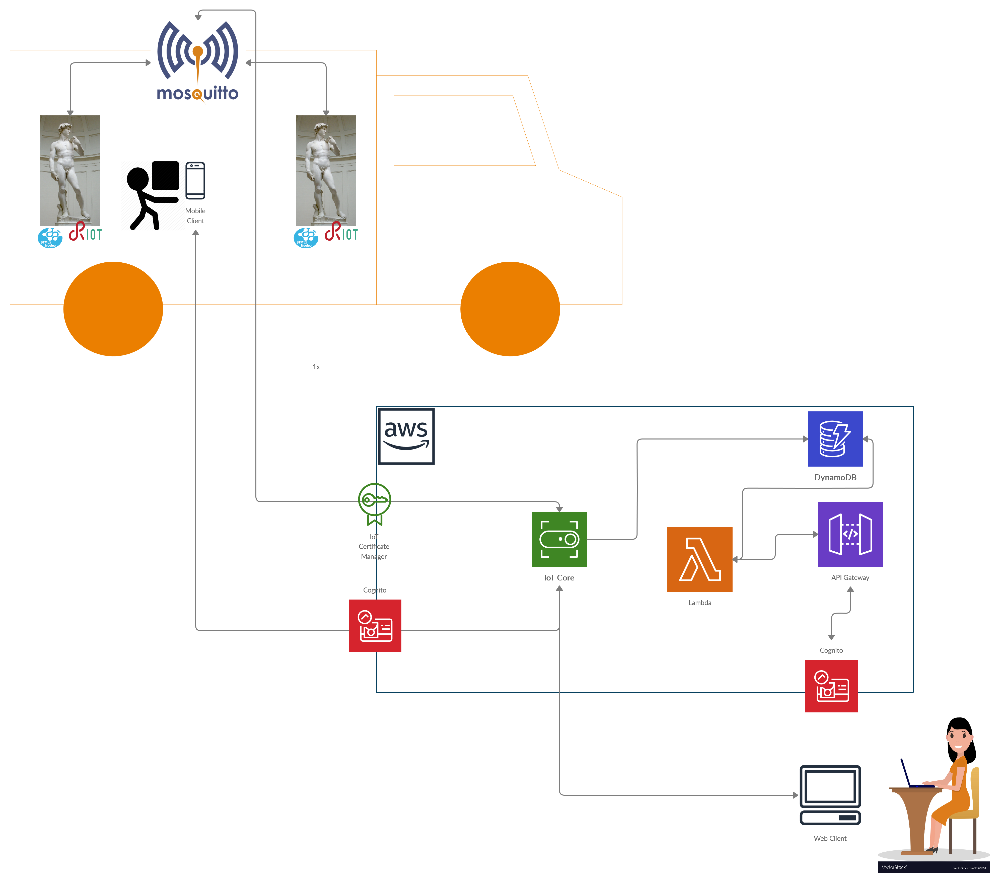

# PlasterSafe Architecture
This section contains references on the architecture used for this project, along with details on how the various technologies interact between each other.
## Overview
The main components of *PlasterSafe* can be seen on the image below:

As we can see:
* The cloud infrastructure will be build on [AWS](https://aws.amazon.com/it/console/), in particular we will use the following services provided by the platform:
  * IoT Core: service that gives us the opportunity to create a broker for each statue,
  * DynamoDb: NoSql database that gives us the opportunity to store data from the statues and the overall application,
  * API Gateway: container that will host Web-APi services for the *mobile appplication*/*web client*. 
  * Lambda: platform service that will Also, it will receive data from the *IoTCore MQTT broker*.
  * Cognito: used to give permissions to users to use the system 
* The statues need to be connected to a local *MQTT-SN broker*, which comes with a gateway that sends data to AWS through an MQTT connection.
* Each statue has board on the support surface. We will take as a reference an [STM 32 Nucleo Board](https://www.st.com/en/evaluation-tools/stm32-nucleo-boards.html), but any board that has the following characteristics can be used:
  * run an instance of [RIOT-OS](https://github.com/RIOT-OS/RIOT),
  * *MQTT-SN* technology support,
  * gyroscope, accelerometer and temperature sensors.
  
  The main goals of the application running on the board will be:
  * retrieve data from sensors and send them to AWS. In particular:
    * if the statue is inside the exhibition, only the temperature will be taken into account. If movements are detected, the platform will send an alarm to museum staff.
    * if the statue needs to be moved, both temperature and movements are sended to AWS.  
  * keep track of the statue's movements and send gyroscope/accelerometer measures through the network.
  
Two end-user applications will interact with this system. This applications consists of:
* A section for the couriers where they can:
  * see if some statues are being moved are subject to extraneous movements,
  * control the movements of the statue while moving.
  
  These task can be done by retrieving the statues measurements directly from the *AWS IoT Core* platform.
* A section for archivists to have a general overview of the museum and be able to do the following task:
  * assign informations to a given statue and see the relative measures from the statue itself,
  * assign a statue to a courier for a particular movement operation. This will give him the opportunity to see the measures taken by the statue.
  * download measures from a given period of time in *csv format* 
  
  This operations will be done by interacting with the *API gateway* using a *webSocket* endpoint.
